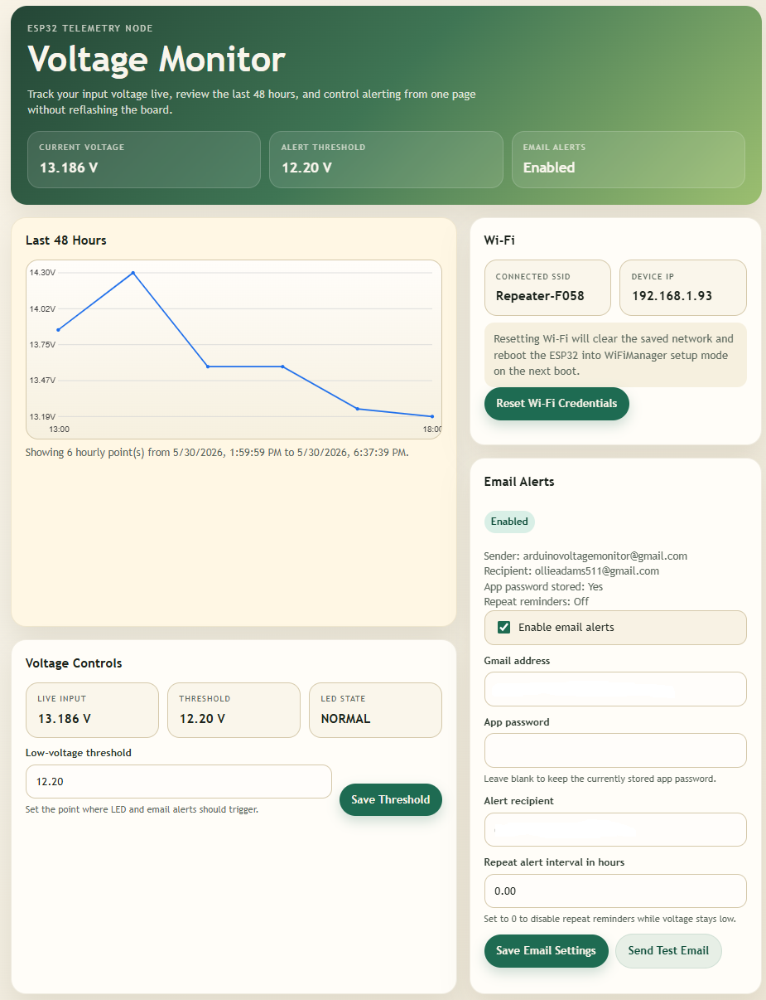

# Arduino Voltage Monitor

ESP32-based voltage monitor with a local web page, live voltage display, hourly graph, low-voltage LED alert, and optional Gmail email notifications.

## Required Arduino Libraries

- WiFiManager
- ESP Mail Client

## Requirements

- ESP32 board
- voltage divider wired as described in [voltage_divider_schematic.md](voltage_divider_schematic.md#L1)
- Wi-Fi network for the device
- Gmail account if email alerts are required

If the sketch becomes too large in Arduino IDE after enabling email support, try a larger ESP32 partition scheme such as `Huge APP` or `No OTA`.

## Wi-Fi Setup

On first boot, WiFiManager will open a configuration portal if the board does not already know your Wi-Fi network.

Default captive portal details in the sketch:
- SSID: `arduino voltage monitor`
- password: `00000000`

## Initial Setup

For first-time setup:

1. Power on the ESP32.
2. On your phone or computer, connect to the Wi-Fi network named `arduino voltage monitor`.
3. Enter the hotspot password `00000000`.
4. If the captive portal does not open automatically, open a browser and go to `192.168.4.1`.
5. Choose your normal Wi-Fi network and enter its password.
6. After the ESP32 connects to your Wi-Fi, reconnect your phone or computer to that same normal Wi-Fi network.
7. Find the ESP32 IP address from the Serial Monitor or your router's connected-device list.
8. Open that IP address in a browser to reach the voltage monitor page.

After connecting the board to Wi-Fi, open the device IP address in a browser.

If you need to move the device to a different network, use the `Reset Wi-Fi Credentials` button on the web page. That clears the saved Wi-Fi network and restarts the ESP32. On the next boot, WiFiManager will open the setup portal again.

## Web Page Functions



The self-hosted page lets you:
- view a graph of the last 48 hours of voltage history
- change the graph plot interval with a slider and save it
- view the current Wi-Fi SSID and device IP
- clear saved Wi-Fi credentials and reboot into setup mode  
- view the current measured input voltage
- change the low-voltage threshold
- enable or disable email alerts
- enter the Gmail sender address
- enter the Gmail app password
- enter the recipient email address
- set repeat reminder interval in hours
- send a manual test email

If the app password field is left blank while saving, the device keeps the previously stored password.

Changing the graph plot interval does not clear the saved graph history. It re-groups the stored 48-hour history into larger or smaller plotted intervals.

Each plotted graph point is the average of all stored readings that fall inside the selected plot interval.

## Gmail Setup

To use Gmail SMTP directly from the ESP32:

1. Create or use a Gmail account dedicated to the device.
2. Turn on 2-Step Verification for that Google account.
3. Go to Google Account Security.
4. Create an App Password for Mail.
5. Copy the 16-character app password.
6. Enter those details on the device web page.

Important:
- use the Gmail app password, not the normal Gmail login password
- the sender account and the app password must belong to the same Google account

## Alert Behavior

Email alert behavior:
- first alert sends when voltage drops below the threshold
- no repeated alerts while voltage stays low unless repeat reminders are enabled
- repeat reminders send every configured number of hours while voltage remains low
- setting repeat hours to `0` disables repeat reminders
- once voltage recovers above threshold plus hysteresis, the alert state resets and the next drop can send a new first alert

## Test Flow

1. Upload the sketch to the ESP32.
2. Open Serial Monitor at `115200`.
3. Connect the board to Wi-Fi.
4. Open the device IP address in a browser.
5. Configure threshold and email settings.
6. Press `Send Test Email`.
7. Check inbox and spam folder.

## Remote Dashboard (GitHub Pages)

This repository includes a static GitHub Pages dashboard (`index.html`) that provides remote access to your voltage monitor data from anywhere with internet access.

### How It Works

The ESP32 → PC → Git → GitHub Pages flow:
1. ESP32 sends voltage data to your local PC via HTTP POST
2. PC receiver writes data to `data/latest.json`
3. Git automation script commits and pushes changes
4. GitHub Pages serves the static dashboard
5. Dashboard fetches and displays the latest data

### Setup

See [HOWTO_PC_GIT_SYNC.md](HOWTO_PC_GIT_SYNC.md#L1) for complete setup instructions including:
- PC receiver script installation
- Git automation configuration
- Running scripts continuously and monitoring status

To monitor both scripts from your Windows taskbar, run the tray status app after installing dependencies:

```powershell
cd service
python -m pip install -r ../requirements.txt
python tray_status.py
```

The tray icon shows real-time status and lets you view logs or open the receiver page.

See [TODO.md](TODO.md#L1) for the full implementation task breakdown.

### Features

The remote dashboard includes:
- Real-time voltage display (auto-refreshes every 60 seconds)
- Full 48-hour history chart with threshold overlay
- Device status (WiFi network, IP address, email alert status)
- Same visual design as the ESP32-hosted dashboard
- Read-only view (no settings controls)

### Enabling GitHub Pages

1. Push `index.html` and `data/` folder to your repository
2. Go to repository Settings → Pages
3. Set Source to "Deploy from a branch"
4. Select branch: `main` (or `master`), folder: `/ (root)`
5. Save and wait a few minutes for deployment
6. Access at `https://yourusername.github.io/voltage-monitor/`

The sample `data/latest.json` file shows the expected JSON format. Once the PC-to-Git automation is running, this file will be automatically updated with real voltage data.
8. If email fails, inspect Serial Monitor output.
